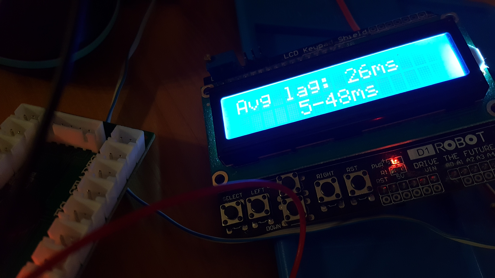
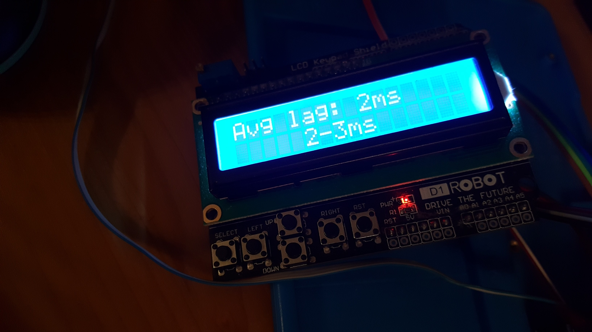
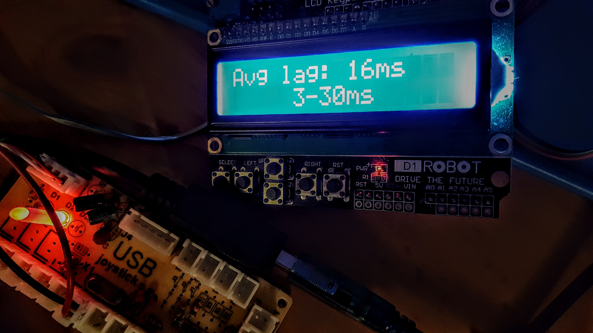
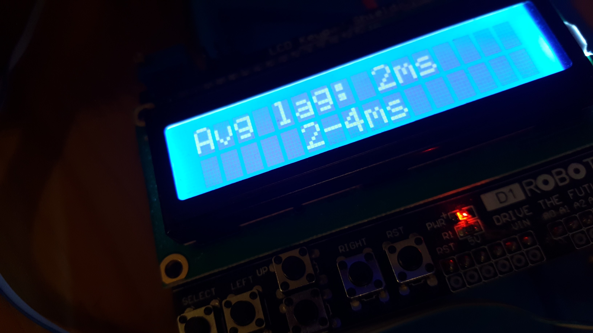
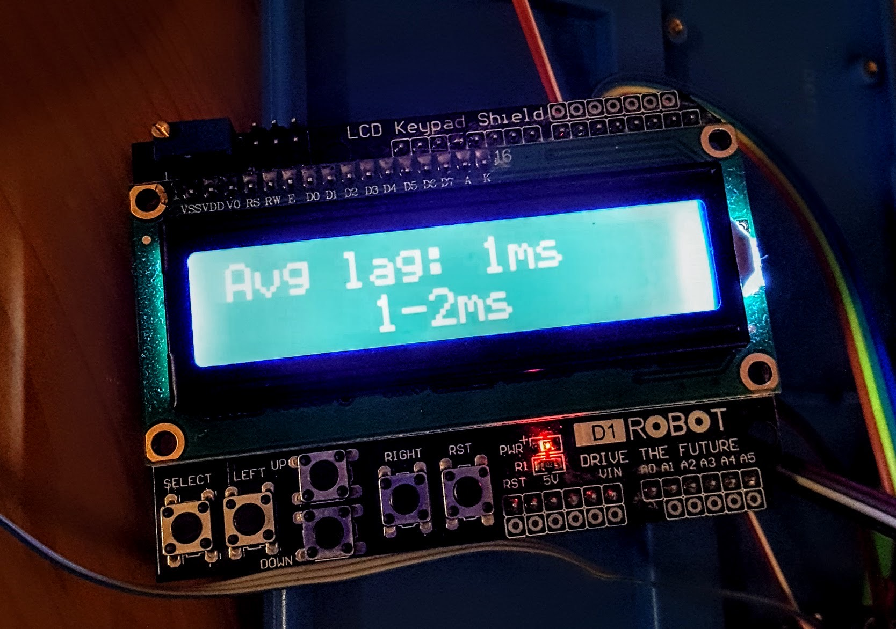
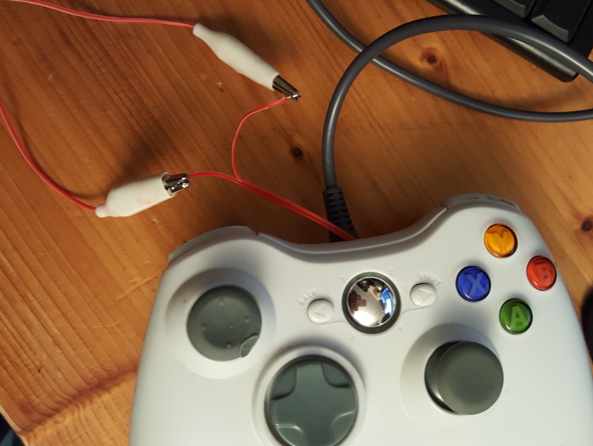

# System under Test - Setup

## HW

- NUC:	Intel NUC-Kit N3050 1.6GHz HD Graphics NUC5CPYH
- BenQ:	BenQ GW2760HS 68,5 cm (27 Zoll) Monitor (DVID, HDMI, 4ms Reaktionszeit, 16:9 Full HD). DVI/HDMI connected.
- EIZO:	Flachbildschirm 1600 x 1200 8-16ms - Eizo FlexScan S2100 21 Zoll HD Display Monitor
- EIZO-SVGA:	EIZO with SVGA signal connected
- EIZO-DVI:	EIZO with DVI signal connected
- Button:	
    - Zero Delay USB Encoder, Dragon Rise Inc.
    - or Teensy FastestJoystick, see my other project here](http://www.github.com/FastestJoystick)
    - or various tested joysticks

### Monitors:

I tried two different monitors.

#### BenQ GW2760HS 27" Monitor - 16:9, Full HD

See https://www.tftcentral.co.uk/reviews/benq_gw2760hs.htm

- Connectors for SVGA, DVI, HMI.
- Response time (according specs): 4ms

Settings:
- AMA: Advanced Motion Accelarator. Possible selections: OFF, HIGH, Premium. Was HIGH.
- PictureMode was 'Standard'. There is a 'Game' mode but I'm not sure if this is really about image processing, if set the image gets brighter.
It has no influence on lag. Same lag if 'Standard' or 'Game'.

#### Eizo FlexScan S2100 21" HD Display Monitor - 4:3, 1600x1200 8-16ms

- PVA screen
- Connectors for SVGA, DVI.
- Response time (according specs): 8-16ms, http://www.webdatenblatt.de/cds/de/?pid=fa6b7ba81603252
    - On/Off Response Time: 16ms
    - Average Midtone Response Time: 8ms 
- This monitor is so old it has no settings that could influence the lag.

### USB Encoders (game controller)

Here are the tested devices together with their default polling rates.
- Buffalo Gamepad: 8ms (10ms)
- DragonRise, ZeroDelay USB Encoder: 8 ms(10ms)
- Ultimarc U360 Stik: 8ms (10ms)
- FastestJoystick (TeensyLC): 1ms

Note: the numbers in brackets are the requested polling times. The real polling times are a little faster.

## SW

- Linux:	Kernel 4.15.0, Ubuntu 16.04.1
- Windows:	Windows 10
- MAME/MESS:	v0.155
- jstest:	jstest-gtk. Joystick tester v0.1.0

## A note about Linux USB polling rates

Most of the joysticks requested a polling rate of 10ms.
I tried to convince Linux to use 1ms instead but without success.
I was also not able to change the mouse polling rate.
Here is what I tried.

Options 'mspoll' or 'jspoll' did change the
/sys/module/usbhid/parameters/mousepoll (or jspoll)
but still I got 125 Hz by testing with the [evhz](https://gitlab.com/iankelling/evhz) program.

I have tried:
- Setting options usbhid mousepoll=1 (jspoll=1) in /etc/modprobe.d/usbhid.conf
- Setting usbhid.mousepoll=8 on the command line while booting
- Running sudo modprobe -r usbhid && sudo modprobe usbhid mousepoll=1 (or jspoll=1) from the command line

The problem is exactly like this [here](https://askubuntu.com/questions/624075/how-do-i-set-the-usb-polling-rate-correctly-for-my-logitech-mouse).

'evhz' results:
- Ultimarc: 90Hz
- Buffalo Gamepad (2nd player): 34 Hz
- DragonRise: 115Hz

Note: when using the teensy as joystick with a requested poll interval of 1ms the Linux is using the 1ms poll interval. Also evhz is showing 1000Hz (but it's important to use the joystick coordinates, e.g. Joystick.X(analogRead(0)), otherwise evhz will not find any event.)

Note: I tested all USB ports of the NUC. All with the same result.

# Test Results

See also [spreadsheet](Docs/LagMeasurements.ods).

## Joysticks

With FastestJoystick it could be seen that the OS response time is about 1-3ms.
FastestJoystick (in former releases) also allowed digital output. So this output can be used to measure the other joysticks more accurate. 
Note: I have meanwhile separated the output part into a new project. So if one would like to re-test he could use [usbout](https://github.com/maziac/usbout).

Setup:
1. The 'FastestJoystick' is connected via USB to the NUC (linux) system. It is used to outut a signal.
2. The USB-Joystick-under-test is connected to the NUC (linux) system.
3. The 'inout' (InputOutput) program is started
4. It will output a digital signal for each button press

With the LagMeter and the digital output connected to the AD2 input (AD2 input is just an analog input) we can measure the minimum response time.

### Joystick Minimum Button Press Time

This measures the minimum time required to press a button so that it is safely recognized by the system (just OS without emulator).

#### FastestJoystick (Teensy)

Constant value of 2ms for more than a day or a million button clicks.
(1457671 button presses, 105240 secs).

#### Buffalo Gamepad

Stopped after 10 mins:
9ms for 10min, 5000 cycles.

#### DragonRise Inc. Generic USB joystick, Zero Delay (Yellow PCB)

Stopped after 3 mins:
22ms for 3 min, 5000 cycles.

#### Microntek USB Joystick (Green PCB)

Stopped after 4 mins:
42ms for 4 min, 1000 cycles.

Note: this might also have something to do with the polling of the USB host. With evhz I was not able to measure it at all.

#### Ultimarc Ultrastik 360

Stopped after 8 mins:
9ms for 8 min, 4000 cycles.

#### Microsoft X-Box 360 pad (white)

Stopped after 3 mins:
21ms for 3 min, 1000 cycles.

#### Microsoft X-Box 360 pad (black)

Stopped after 5 mins:
8ms for 5 min, 3000 cycles.

### Joystick turnaround time

Here the delay is measured from button press until a response (digital out).
So we measure the delay consisting of:
- USB polling
- Game controller delay
- OS delay
- FastestJoystick output delay (1-2ms)

#### FastestJoystick (Teensy)

Repeated delay measuremens (100 cycles): 3-5ms. 

(Very independent of system load. Same times measured also with attract-mode and mame running at the same time in the foreground).

Note: when added a USB 2.0 hub this increases by 1ms to: 4-6ms.

#### Buffalo Gamepad

Delay measurement (100 cycles): 1-9 ms

#### DragonRise Inc. Generic USB joystick, Zero Delay (Yellow PCB)

Delay measurement (100 cycles): 2-31 ms

#### Microntek USB Joystick (Green PCB)

Delay measurement (100 cycles): 4-47 ms

#### Ultimarc Ultrastik 360

Delay measurement (100 cycles): 8-17 ms (down to 3-6ms with special firmware see below)

Note: The Ultrastik 360 is an analog joystick. 
I had no possibility to measure the USB analog axes delay directly.
Instead I measured the button input delay of the device and assume that the analog axes delay is very similar.

More notes:
The measurements above were done with the "normal" firmware (e.g. Ultrastik_37.ufw).

##### Special Firmware 

I also tested the Ultrastik_37_analogueout.ufw firmware which doesn't work as an USB joystick but instead puts the axes analog out to pins 9 and 10.
This showed that the AD/DA conversion is fast enough.

The picture shows the moving of the joystick from center to e.g. "up". This was carried out manually and I could achieve this in about 10 ms. You can see this from the voltage which reaches its maximum after 10 ms.

When we increase the resolution we can also see the staircase pattern of the AD/DA conversion:

So I think it's safe to assume that the UStik360 internally requires 0.5 ms for an AD/DA conversion. That's fine.

From Andy I also got special firmware with different requested USB poll times:
- 2 ms: This gives a delay of 3-7 ms (100 cycles)
- 1 ms: This gives a delay of 3-6 ms (100 cycles). I.e. it does not really improve anymore compared to 1ms. (Maybe I need to repeat this with the NUCi7?)
Note: with evhz is also measured 500Hz "only". With FastestJoystick I can reach up to 1000Hz in evhz.

Note: when added a USB 2.0 hub the (1ms poll) measurements are very much the same: 3-6ms.

#### Microsoft X-Box 360 pad (black)

Delay measurement (100 cycles): 4-14 ms

### Joystick turnaround time (lag)

Here also he delay is measured from button press until a response.
The setup is much easier.
The joystick is simply attached to the Arduino USB Host Shield.
One of the joystick's buttons is stimulated by the LagMeter.
The Host shield will poll the joystick, press the button and measure the time until it receives a response (button press) from the joystick.

Note: for the measurements the poll time requested by the joystick device was used.

#### FastestJoystick (Teensy)

100 cycles: 2-3ms

#### Buffalo Gamepad

Was destroyed (i.e. HW changed to Teensy) at that time.

#### DragonRise Inc. Generic USB joystick, Zero Delay (Yellow PCB)

100 cycles: 3-30ms

#### Microntek USB Joystick (Green PCB)

Delay measurement (100 cycles): 5-48 ms

#### Ultimarc Ultrastik 360

Delay measurement (100 cycles): 2-4 ms

Note: This was done with the special firmware with requested 1ms poll time.

#### Microsoft X-Box 360 pad (white)

Attention: Here another xbox controller, a white one, was used.

Delay measurement (100 cycles): 1-2 ms

This was the best result of all joysticks. Interesting enough this was the **cheaper** of the 2 xbox controllers.

I soldered a cable inside the controller in order not to have to open it everytime I want to do a measurement:

## OS

With FastestJoystick the complete turnaround time from button press to digital out was constantly 3-5ms.
The FastestJoystick input delay is 0.2ms. Its output delay is <<1ms.
The USB polling was 1ms.
So the theoretical minimum is 0.2ms(inp-delay)+1ms(poll)+0ms(output delay) = 1.2ms.
The theoretical maximum is 1.2ms(inp-delay+poll)+1ms(poll)+1ms(output delay) = 3.2ms.
The rest is OS delay: 2ms.

This even does not change if in parallel an emulator is running or started.
Even with 100% cpu load for both cpus (program 'stress' was used) this did not change.

## Monitor

Measured with photo resistor.

### Results for the Test Setup

The Monitor delay is dependend on the position of the photo sensor on the screen:
With BenQ for example: If the photosensor is positioned at the top the delay is 11ms (to SVGA).
If it is positioned at the bottom the delay is 20ms (toSVGA). 
But this can be explained: the SVGA already start to measure with the first while line, i.e. the top line.
(And as expected the difference in delay if the photo sensor is positioned left or right is neglectible.)

To minimize this effect for the measurements I chose a position always at the top.

### Monitor Delay Depending on Input Connector

The delay of the Eizo itself is 38ms (DVI) and 30ms (SVGA). The BenQ has 12-13ms no matter what input.

I.e. Eizo SVGA input is faster than EIZO DVI input by 8ms. DVI = 38ms, SVGA = 30ms. The delay is very constant.

## NUC Video Output Connector

Measured with AD2 (SVGA) signal.

The NUC has an SVGA and a HDMI output conenctor.
There is no difference in lag for both outputs.

## MAME/MESS

### Different MAME Versions

Measured with photo resistor.

I tested MAME (or better MESS) version 0.155 and 0.214.
Both emulators showed exactly the same delay.
(At least with driver ZXSpectrum).

### Windowed vs. Fullscreen

There seems to be no difference. 

### Shader

The (mameau) CRT geometry shader in MAME adds 10-14 ms to the overall lag.

# Results

## Joysticks

Many USB controller gamepads do strange things especially the cheaper ones.
Very bad is the variance in the delay which could be seen in the Zero Delay USB encoder cards: 2-31 ms and 3-47ms.
This is not really usable.

The Buffalo Gamepad was a surprise. It had a very low delay of 1ms. Unfortunately it uses a polling rate of 8ms so the total delay results in 1-9ms.
Anyhow it would be a good result but unfortunately the Buffalo Controller is reported for its ghosting and yes, also my Buffalo had ghosting:
The left direction is "pressed" quite often (5x in 10mins), the right direction about 1x in 10mins.

The XBox controllers do not give a unique picture.
One device (black) had 4-14ms lag. This is OK but not really good.
The other (the white one) was the winner with only 1-2ms delay. Interesting enough this was the cheaper of the 2 xbox controllers.

The original Ultrastik 360 is OK with 8-17ms but not really good. But I discussed with Andy from Ultimarc and got a special firmware that requested a 1ms poll time only.
With this special firmware the response lag dropped down to 2-4ms which is really good.

## Monitor

To avoid tearing, waitvsync=1 has to be turned on in mame and mess.
The BenQ monitor is faster than the EIZO. At least 1 frame.

# Conclusions for my Arcade Cabinet

1. Joysticks:
    - I had used the "Zero Delay USB Encoder, Dragon Rise Inc." for the buttons. This was removed completely. The measurements showed that the lag and the variation in lag are not usable for a joystick. At max. this USB encoder could lead to 2 frames lag.
    - Main joystick: With the special 1ms firmware the Ultrastik 360 joystick is nearly as fast as my other project, the FastestJoystick. So the Ultrastik is an excellent choice now for my cabinet. 
    - The 2nd joystick: I had used a Buffalo as a 2nd attachable joystick (for 2 player games). This has been replaced by the FastestJoystick Teensy.
2. Monitor: The Eizo introduces a delay of 1.5 frames delay which is far too big. This monitor needs to be exchanged. 

I started with a delay of 96-153ms for the whole system.
Now (without monitor) I'm at 35-71ms. I have to buy a new (fast) monitor then I hope that I can reduce the original delay by about 50%.

