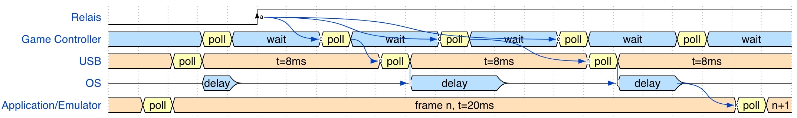
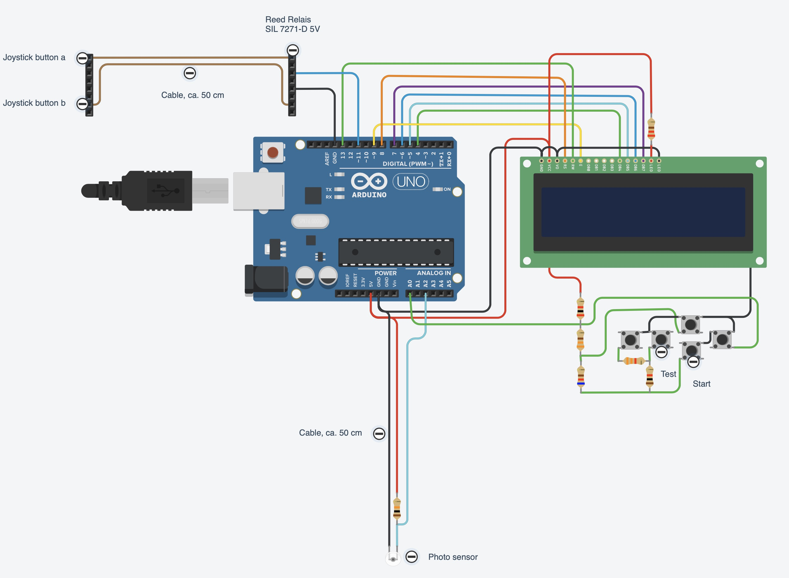
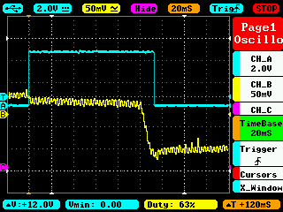
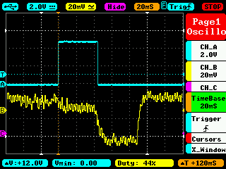
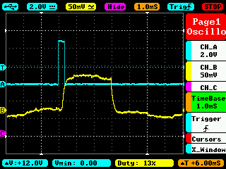
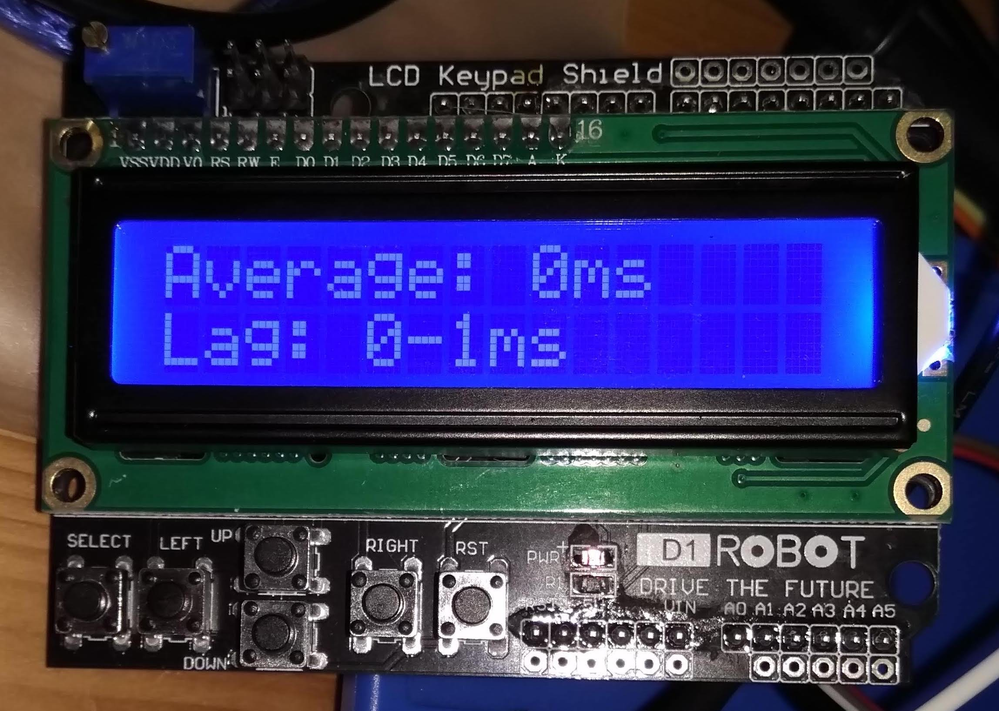

# LagMeter

The goal of this project is to build a HW/SW that allows for easy measurement of input (output) lag.

The tested setup in my case is a self-made aracde cabinet which is based on a debian/Linux and an Intel NUC HW. But the LagMeter can also be used for other PC-like or even console-like setups.
The results of the measurements can be found [here](Docs/LagMeasurements.md).

The LagMeter will stimulate a button on a controller and measure the time it takes until a reaction occurs on the monitor.
Apart from the LagMeter itself some SW is required on the tested system that changes the color or brightness of a (small) area on the screen depending on the state of the input device (the button press).
For Linux the jstest-gtk program is enough, for Windows the "Windows USB Controller Setup" program does the job.
If it is required to measure the lag including some emulator lag it is necessary to run a program on the emulator that changes the brightness of the screen depending on the input.

## Disclaimer

This is mainly a HW project and with HW projects, although the risk should be small, it is always possible that you damage your HW or HW that you are going to measure.
You should only try to do this yourself if you already have experience with electronics and baiscally know what you are doing.

IN NO EVENT SHALL THE AUTHOR BE LIABLE FOR ANY SPECIAL, DIRECT, INDIRECT, OR CONSEQUENTIAL DAMAGES OR ANY DAMAGES WHATSOEVER RESULTING FROM THE USE OF THE HW, SCHEMATICS, SW OR ANYTHING ELSE PRESENTED HERE.

# Lag

## Theory

There are a lot of entities that sum up to the total lag.
Here are the most important ones:
- **Controller lag**: The controller is normally a USB device. It contains a CPU to measure the button presses and then transmits the status via USB. (Wireless controllers add an additional lag of about 5ms.)
- **USB lag**: This is caused by the USB polling rate. An USB device cannot simply send data to the host when e.g. a button is pressed. Instead it has to wait until it is polled from the host to send the button status. The USB polling rate is usually (default) 10ms and can be reduced down to 1ms.
- **OS lag**: The time the operating system requires to process the USB data and pass it to the user land, i.e. the application.
- **Application lag**: The time the application (e.g. jstest-gtk or an emulator) requires to read the input and react on it. This is in the range of a few frames, e.g. n*20ms. Triple buffering or enabling of graphics effects will increase the lag.
- **Video encoding lag**: Creating the video signal will also introduce a little lag. I'm not sure, mabye this is neglectible, but in theory it is there and can also vary for the used encoding, i.e. SVGA vs HDMI.
- **Monitor lag** (response time): The monitor needs some time from input of the signal until it is displayed. This typically is in the range of a few ms up to some frames (n*20ms). It is important to disable any video processing inside the monitor as this adds extra delay. This is normally done by putting the monitor in a special 'game mode' via its settings. The monitor lag might also vary depending on the used video signal. I.e. the lag for SVGA and HDMI might be different even for the same monitor.

It would be beneficial if we could measure each lag individually but this is normally not possible.
Only the sum of lags can be measured and conclusions might be drawn that may or may not be correct :-)

## Influence of Intervals (Polling)

Understanding the impact of polling intervals is essential when dealing with input lag.
When the joystick button is pressed it is not immediately send to the program that evaluates it. Instead the button value is polled at certain intervals.
Depending on the time when the button is pressed relative to the poll a different time is required until the button press information arrives at its destination.
This is the most common source of introduced lag. And the bad thing about it is that it is not constant: the lag time varies at exactly the polling interval time.
Therefore it is important to use short (or better no) polling wherever possible.
It simply increase the variance in the lag.

Unfortunately there is not only one component that introduces lag via polling.
There are at least:
- The USB controller (normally it is not possible to obtain the sources for the firmware of a controller so a particular controller might could work differently but in general it is safe to assume that the buttons etc. are polled at a certain frequency.)
- The USB polling inside the OS. This is often set to 8ms (125Hz) but can be reduced to a minimum of 1ms.
- The emulator polling the joystick: This is done at frame rate, i.e. 20ms (50Hz) for Europe and 16.7ms (60Hz) for US.
- The monitor signal HW: This as well uses the frame rate, i.e. 20 or 16.7ms, but might not be in sync (vsync) with the emulator.
Note: Of course you could increase the frame rate to lower the interval/lower the latency. The problem is that if you use another frame rate than the source (i.e. the emulator) you may encounter other visual artefacts.

The picture below tries to visualize the effect of the polling:

<!--
~~~wavedrom
{signal: [
  
  {name: "Relais",
   wave: 'l....H.................',
   node: '.....a'},
  
  {name: "Game Controller",
   wave: '5..35..35..35..35..35..',
   data: ["", "poll", "wait", "poll", "wait", "poll", "wait", "poll", "wait", "poll", "wait",],
   node: '.......cC..dD..eF'},
  
  {name: "USB",
   wave: '4.34.....34.....34.....',
   data: ["", "poll", "t=8ms", "poll", "t=8ms", "poll", "t=8ms", "poll",],
   node: '.........gG.....hH.....'},
  
  {name: "OS",
   wave: 'z..5z.....5..z...5.z...',
   data: ["delay", "delay", "delay",],
   node: '..........i..I...j.J'},
  
  {name: "Application/Emulator",
   wave: '434..................34',
   data: ["", "poll", "frame n, t=20ms", "poll", "n+1", "poll",],
   node: '.....................kK'},
  ],

edge:[
      'a~>c',
      'a~>d',
      'a~>e',
      
      'C~>g',
      'D~>h',

      'G~>i',
      'H~>j',

      'J~>k',
      'K~>l',
      'l~>m'
 ],

}
~~~
-->

Relais is the simulated button press. When it's pressed the game controller notices after a few ms depending of the firmware.
This value is not directly provided to the OS. Instead the USB host controller (of the PC) polls at 8ms (default, 125Hz).
The OS receives the value and provides it to the application after some delay. This delay should be short but is not necessarily fixed, i.e. depending on the current load of the CPU it might vary.
Then the application, i.e. the emulator, reads the button value. It polls usually at the frame rate, i.e. 20ms for Europe.

In best case all pollings happen just right after each other. In that case only a small delay, the delay of the OS, would be measurable.
In worst case all polling intervals have to be added. I.e. Game controller interval (e.g. 10ms), USB interval (8ms), OS delay (5ms?), Emulator frame rate (20ms) = 10+8+5+20 = 43ms.

I.e. already with these small value we end up with a jitter of 5ms to 43ms for a button press.
But that is just the path to the emulator game controller input.

The full path needs to draw and display something on the monitor:

<!--
~~~wavedrom
{signal: [
  
  {name: "Application/Emulator",
   wave: '4...34.................',
   data: ["frame n+1, t=20ms", "", "frame n+2, t=20ms", "",],
   node: '....K'},

  {name: "Screen (Out)",
   wave: '5......5...............',
   data: ["frame n+1", "frame n+2, t=20ms", "frame n+3",],
   node: '.......l'},
  
  {name: "Monitor",
   wave: '5......5.3.............',
   data: ["", "delay", "frame n, t=20ms", "delay", "frame n+1, t=20ms",],
   node: '.........m'},

  {name: "Visible Response",
   wave: '0........1.............',
   data: ["", "delay", "frame n, t=20ms", "delay", "frame n+1, t=20ms",]},
],

edge:[
      'a~>c',
      'a~>d',
      'a~>e',
      
      'C~>g',
      'D~>h',

      'G~>i',
      'H~>j',

      'J~>k',
      'K~>l',
      'l~>m'
 ],
}
~~~
-->

The emulator needs at least one frame to calculate the next frame depending on the game controller's input (button press).
(This is quite optimistic, often, depending on the emulated game, the emulator needs more frames. Then depending on the emulator's settings it might need additional frames, e.g. for triple buffering or for post processing of the screen output.)

The rendered frame needs to be go out of PC. This is also done at frame rate and will add an additional delay.
If the emulator's output is synched (VSYNC) with the PC screen output this delay can be reduced to 0.

At the end the monitor will add some delay. This depends on the monitor. Modern monitors should be in range 1-4ms, older monitors could around 20ms.
Sometimes monitors (especially TVs) may add post processing. This can increase the delay dramatically and should be turned off.

For a synched emulator, a one frame emulator delay and a monitor with 4ms delay we will end up at: 20+0+4 = 24ms.

With the calculation above we end up with a theoretical lag for these explanatory values of
[5ms;43ms] + 24ms = [29ms;71ms], i.e. **29ms to 71ms**.

## Interpret Measurement Results with Polling

When measuring delays and polling is involved the measured times vary between a minimum and a maximum value.
If the count of measurements is large enough the minimum measured time is the time as if there weren't any influence of the polling. 
Whereas the maximum value adds up all polling intervals.
I.e. max-min shows us the time that is lost due to polling.
At least if nothing unforeseen happens: In an operating system like linux, windows or mac it can, of course, always happen that some process delays other process for a short while. 
So the max-min value is expected to be bigger than the sum of all unsynchronized polling times.

# Additional lag by the measuring equipment

The HW uses a relais to stimulate the button press and a phototransistor to measure the resulting change on the screen.
Both have lags.
I measured that the reed relais (Relais SIL 7271-D 5V) bounces for max 40us and has a switching delay which is smaller than 250us.
The lag of phototransistors in general is in the magnitude of us.

I measured the lag with a LED tight to the reed relais and the overall shown lag was always 1ms.
So it's safe to assume the additional lag by relais and phototransistor is negligible.

# Emulator Pause Frame Stepping vs. Dynamic Delay

The usual way to measure the lag of an emulator an an easy was is to pause the emulator,
press a button and single-step the emulator frame-by-frame until a visual response is seen on the monitor.

With this one can find out quite easily the lag of the game's logic that is tested.
In e.g. MAME this can be done by pressing 'P' (for pause) and then pressing SHIFT-P to single step each frame.

Unfortunately this is only half of the truth since the dynamic behaviour is little different.
If the emulator e.g. use triple buffering or post processing the additional delay cannot be seen by frame-stepping but the delay is there when running at normal speed.

So, even if you see that there is only one frame delay when single stepping the frames, most probably at least one more frame is used e.g. for buffering/screen processing.

# HW

## Schematics (TinkerCad)

Note 1: You don't need to wire the LCD and buttons if you use the LCD Keypad shield. It already contains the buttons and the correct connections.

Note 2: I had trouble with the contrat of the HD44780 1602 lcd Display. It turned out that the contrast became much better after I put a resistor (100 Ohm) in the +5V poer connection of the LCD. 
I found this tweak here: https://forum.arduino.cc/index.php?topic=337502.msg4248679#msg4248679
Maybe you need to play around with the values a little bit.

## Components List

- Arduino Uno R3
- Reed Relais SIL 7271-D 5V
- Phototransistor BPX 38-3 OSO
- R=470k
- USB Host Shield v2.0
- HD44780 LCD Module Display (without I2C)
- 5x buttons
- Resistors: 330, 620, 1k, 2k2, 3k3

Note: Instead of the LCD Module, the buttons and the resistors you could also use a LCD Keypad Shield.

# SW

## Arduino SW

There are 2 main functionalities implemented:
- The "LagMeter" which stimulates a game controller button and measures the time until a response (visual response on the monitor, the SVGA signal or another output).
- The "UsblagLcd" which directly measures the lag of a USB game controller by stimulating a button and measuring the response through the USB protocol. This part is derived from the [usblag](https://gitlab.com/loic.petit/usblag) project. It adds an UI via an LCD display.

The device starts up in the LagMeter mode and stays there.

To change to UsblagLCD mode you need to attach an USB game controller. If it is recognized the display changes:

Note: the UsblagLCD mode cannot be left automatically, you need to press reset to get back to the LagMeter mode.

### Installation

Assuming that you have the Arduino IDE, just install the library USB Host Shield Library 2.0 in the Tools > Manage Libraries section.

### LagMeter 

The LagMeter uses 5 different buttons. Each button offers a different test:
- **"Button ON/OFF"**: Will simply output the value measured at the photo resistor. At the same time a button press/release is stimulated at a frequency of approx. 1s. This is to check that the photo resistor is working and to check the values when button is pressed and released.
- **"Test: Button -> Photosensor" (Total Monitor Lag)**: It starts with a short calibration phase. During calibration the button is pressed for a second and the monitor output, i.e. the photo transistor value is read. 
Then the button is released and the photo transistor value is read again.
Afterwards 100 measurement cycles are done with button presses and releases. For each button press the time is measured until an action occurred on the screen.
At the end the minimum, maximum and average time is shown.
If a measurement takes too long (approx 4 secs) an error is shown.
You need a program that reacts on game controller button presses. E.g. jstest-gtk in Linux. The photo sensor need to be arranged just above the (small) screen area that changes when the button is pressed.
For the tests with the emulator you can use the ZX Spectrum program (sna-file) in this repository. It reads the (ZX Spectrum) keyboard and toggles the screen (e.g. black/white). 
In the emulator you need to map the game controller button to the "0" Spectrum key.
- **"Test: Button -> AD2 (eg.SVGA)" (Total SVGA Lag)**: Same as "Total Monitor Lag" but instead of measuring the photo transitor it monitors the SVGA output of the PC. I.e. as a result you get the lag without the monitor.
- **"Test: SVGA -> Photosensor" (Monitor Lag)**: This measures the monitor lag itself. For this you need to connect all cables: Game controller button, photo transitor (at monitor) and SVGA at the SVGA output ofthe PC (because the monitor is connected as well you need a Y-SVGA adapter to connect both at the same time).
Please note: monitor manufacturers have very sophisticated ways to measure the latency. The way used here is very simple, so the results may differ from your monitor's specification.
- **"Minimum Button Press Time/Reliability Test"**: It measures the minimumt time required to press the game controller's button so that it is reliably recognized. Because of polling intervals (see above) it can happen that a button press is not recognized at all if it is too short. This test measures the time and the number of button presses for a certain button press time. Whenever a button press doesn't lead to a visual response the minimum press time is increased andthe test starts all over again.
The test will run "forever", i.e. you can leave it running for a day to see if your system really catches all button presses. Or to put in another way: the tests shows you how long you have to press the button at a minimum so that it is reliably recognized.
To give some numbers: my measurements showed that with a micro switch the minimum achievable press time is around 40ms, but with leaf switches you could get down to e.g. 10-20ms. If this is good or bad depends on the rest of the system. In general it is nice to allow for short times but if the time gets smaller than the polling rate of your system than it might lead to unrecognized button presses.
Wit a few buttons you can change the press time:
  - +1ms
  - -1ms
  - +10ms
  - -10ms

You can interrupt all measurements by pressing any key.

### UsblagLcd

The UsblagLcd uses 3 different buttons with different tests:
- **"Button: ON/OFF"**: Will toggle between button press/release at a frequency of approx. 1s. You should see the LCD display changing when a game controller's button is pressed. 
For a simple test you can attach your game controller and press the buttons manually. You should see the LCD display changing.
Then you can open your game controller and attach the cables to a button to simulate button presses. If this works you see the LCD display changing at the toggle frequency.
- **"Test: USB ?ms" (Game Controller Lag)**: Measures the lag of the game controller, i.e. from button press to USB response.
Connect the button of your game controller with the cable and start the test.
It does 100 cycles and shows the minimum, maximum and average time used by the controller.
The test uses the USB polling rate requested by the USB controller. The used polling rate is displayed.
- **"Test: USB 1ms" (Game Controller Lag)**: Same as before but this test uses a fixed polling rate of 1 ms. Not available for XBOX controller.

You can interrupt all measurements by pressing any key.

# Validation

I did a few tests to validate the measured times.

## Reed Relais SIL 7271-D 5V

Measurements with oscilloscope:
- Switch bouncing is less than 40us

- Delay: 5V Out to relais switching: < 250us

Both together are << 1ms.

## Photo sensor 

Response time (cyan is the compare-digital-out, starts with button, ends when photo sensor range is met):

- Photosensor (yellow) attached to EIZO monitor:

Time from dark to bright is around 10-15ms, this might be due to the monitor requiring some time to fully light the area.

- Photosensor (yellow) attached to BenQ monitor:

Time from dark to bright here is also  around 10-15ms. What can be seen as well is that the overall response time for the BenQ is much shorter.

- Photosensor (yellow) attached simply to an (inverted) LED:

Response is very fast, within 0.5ms.

The code to measure the lag has a check to test that the time between 2 measurements does not become bigger than 1ms. In that case it would show an error in the display.

## Direct feedback with LED

I put an LED to the relais. The LED emitted light into the photo sensor. 
This is the fastest feedback that could be measured. With the accuracy considerations above the overall lag should be max. 1ms.

Here is the result for 100 test cycles:

# References

- ["Controller Input Lag — How to measure it?" by Loïc *WydD* Petit](https://medium.com/@WydD/controller-input-lag-how-to-measure-it-1ebfd2c9d60)
- [usblag by Loïc Petit](https://gitlab.com/loic.petit/usblag)
- ["Turn your ProMicro into a USB Keyboard/Mouse" by jimblom](https://www.sparkfun.com/tutorials/337)
- ["Zero Delay USB encoders lag measurements - THEY HAVE LAG - AVOID" by oomek](http://forum.arcadecontrols.com/index.php?topic=153825.0)
Video comparing zero delay vs. Arduino encoder. zero delay is lagging.
- ["On the Latency of USB-Connected Input Devices" - by Raphael Wimmer, Andreas Schmid and Florian Bockes (Uni Regensburg)](https://epub.uni-regensburg.de/40182/1/)On_the_Latency_of_USB-Connected_Input_Devices_author_version.pdf
- ["Warum haben Emulatoren eine Eingabeverzögerung?" by MarcTV](https://marc.tv/warum-haben-emulatoren-eine-eingabeverzoegerung/)
- [Linux USB polling rate](https://wiki.archlinux.org/index.php/Mouse_polling_rate)
- [evhz](https://gitlab.com/iankelling/evhz)
- [FastestJoystick](https://github.com/maziac/fastestjoystick)

# License

These sources contain modified code from the [USB Host Shield Library 2.0](https://github.com/felis/USB_Host_Shield_2.0). This code is in the src/usb directory. The original code is GPL2. Thus also the modifed code is GPL2.

The rest of the sources alone (without src/usb directory) is under MIT Licence. So the complete SW in a whole is GPL2 because of copyleft.

