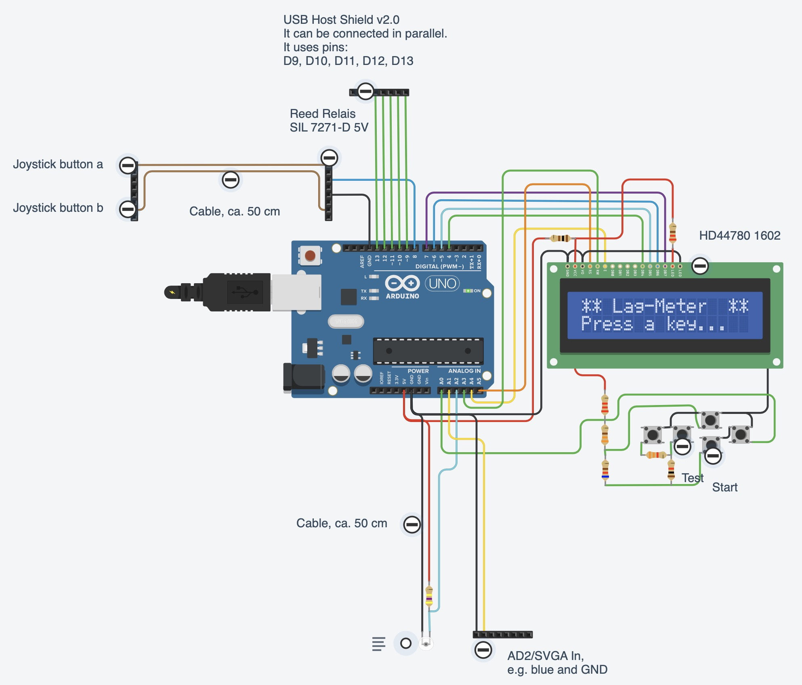

# LagMeter

**Note: This is still work in progress. I.e. not finished. Conclusions/SW/HW is not ready for public usage. Use only on your own risk.**

The goal of this project is to build a HW/SW that allows for easy measurement of input (output) lag.

The tested setup in my case is a self-made aracde cabinet which is based on a debian/Linux and an Intel NUC HW. But the LagMeter can also be used for other PC-like or even console-like setups.

The LagMeter will stimulate a button on a controller and measure the time it takes until a reaction occurs on the monitor.
Apart from the LagMeter itself some SW is required on the tested system that changes the color or brightness of a (small) area on the screen depending on the state of the input device (the button press).
For Linux the jstest-gtk program is enough, for Windows the "Windows USB Controller Setup" program does the job.
If it is required to measure the lag including some emulator lag it is necessary to run a program on the emulator that changes the brightness of the screen depending on the input.

## Disclaimer

This is mainly a HW project and with HW projects, although the risk should be small, it is always possible that you damage your HW or HW that you are going to measure.
You should only try to do this yourself if you already have experience with electronics and baiscally know what you are doing.

IN NO EVENT SHALL THE AUTHOR BE LIABLE FOR ANY SPECIAL, DIRECT, INDIRECT, OR CONSEQUENTIAL DAMAGES OR ANY DAMAGES WHATSOEVER RESULTING FROM THE USE OF THE HW, SCHEMATICS, SW OR ANYTHING ELSE PRESENTED HERE.

# Lag

## Theory

There are a lot of entities that sum up to the total lag.
Here are the most important ones:
- **Controller lag**: The controller is normally a USB device. It contains a CPU to measure the button presses and then transmits the status via USB. (Wireless controllers add an additional lag of about 5ms.)
- **USB lag**: This is caused by the USB polling rate. An USB device cannot simply send data to the host when e.g. a button is pressed. Instead it has to wait until it is polled from the host to send the button status. The USB polling rate is usually (default) 10ms and can be reduced down to 1ms.
- **OS lag**: The time the operating system requires to process the USB data and pass it to the user land, i.e. the application.
- **Application lag**: The time the application (e.g. jstest-gtk or an emulator) requires to read the input and react on it. This is in the range of a few frames, e.g. n*20ms. Triple buffering or enabling of graphics effects will increase the lag.
- **Video encoding lag**: Creating the video signal will also introduce a little lag. I'm not sure, mabye this is neglectible, but in theory it is there and can also vary for the used encoding, i.e. SVGA vs HDMI.
- **Monitor lag** (response time): The monitor needs some time from input of the signal until it is displayed. This typically is in the range of a few ms up to some frames (n*20ms). It is important to disable any video processing inside the monitor as this adds extra delay. This is normally done by putting the monitor in a special 'game mode' via its settings. The monitor lag might also vary depending on the used video signal. I.e. the lag for SVGA and HDMI might be different even for the same monitor.

It would be beneficial if we could measure each lag individually but this is normally not possible.
Only the sum of lags can be measured and conclusions might be drawn that may or may not be correct :-)

## Additional lag by the measuring equipment

The HW uses a relais to stimulate the button press and a phototransistor to measure the resulting change on the screen.
Both have lags.
I measured that the reed relais (Relais SIL 7271-D 5V) bounces for max 40us and has a switching delay which is smaller than 250us.
The lag of phototransistors in general is in the magnitude of us.

I measured the lag with a LED tight to the reed relais and the overall shown lag was always 1ms.
So it's safe to assume the additional lag by relais and phototransistor is negligible.

## Influence of Intervals (Polling)

Understanding the impact of polling intervals is essential when dealing with input lag.
When the joystick button is pressed it is not immediately send to the program that evaluates it. Instead the button value is polled at certain intervals.
Depending on the time when the button is pressed relative to the poll a different time is required until the button press information arrives at its destination.
This is the most common source of introduced lag. And the bad thing about it is that it is not constant: the lag time varies at exactly the polling interval time.
Therefore it is important to use short (or better no) polling wherever possible.
It simply increase the variance in the lag.

Unfortunately there is not only one component that introduces lag via polling.
There are at least:
- The USB controller (normally it is not possible to obtain the sources for the firmware of a controller so a particular controller might could work differently but in general it is safe to assume that the buttons etc. are polled at a certain frequency.)
- The USB polling inside the OS. This is often set to 8ms (125Hz) but can be reduced to a minimum of 1ms.
- The emulator polling the joystick: This is done at frame rate, i.e. 20ms (50Hz) for Europe and 16.7ms (60Hz) for US.
- The monitor signal HW: This as well uses the frame rate, i.e. 20 or 16.7ms, but might not be in sync (vsync) with the emulator.
Note: Of course you could increase the frame rate to lower the interval/lower the latency. The problem is that if you use another frame rate than the source (i.e. the emulator) you may encounter other visual artefacts.

<<xxxxx>>

## HW

### Schematics (TinkerCad)

Note: You don't need to wire the LCD and buttons if you use the LCD Keypad shield. It already contains the buttons and teh correct connections.

### Componentes List

- Arduino Uno R3
- LCD Keypad Shield
- Reed Relais SIL 7271-D 5V
- Phototransistor BPX 38-3 OSO
- R=22k
- C=4.7uF/16V
- USB Host Shield v2.0

## SW

### Arduino SW

There are 2 main functionalities implemented:
- Press "Test" button: Will simply output the value measured at the photo resistor. At the same time a button press/release is stimulated at a frequency of approx. 1s. This is to check that the photo resistor is working and to check the values when button is pressed and released.
- Press "Start" button: This is the main program, i.e. the lag measurement. It starts with a short calibration phase. During calibration the button is pressed for a second and the monitor output, the photo transistor value is read. 
Then the button is released and the photo transistor value is also read.
Afterwards 100 measurement cycles are done with button presses and releases. For each button press the time is measured until an action occurs on the screen.
At the end the minimum, maximum and average time is shown.
If a measurement takes too long (approx 4 secs) an error is shown.

You can interrupt all measurements by pressing any key.

This consists of a program that stimulates a button through an OUTPUT_PIN. Then it measures the time until the input value (from a photo resistor) changes.

# Validation

I did a few tests to validate the measured times.

## Reed Relais SIL 7271-D 5V

Measurements with oscilloscope:
- Switch bouncing is less than 40us

- Delay: 5V Out to relais switching: < 250us

Both together are << 1ms.

## Photo sensor 

Response time (cyan is the compare-digital-out, starts with button, ends when photo sensor range is met):

- Photosensor (yellow) attached to EIZO monitor:

Time from dark to bright is around 10-15ms, this might be due to the monitor requiring some time to fully light the area.

- Photosensor (yellow) attached to BenQ monitor:

Time from dark to bright here is also  around 10-15ms. What can be seen as well is that the overall response time for the BenQ is much shorter.

- Photosensor (yellow) attached simply to an (inverted) LED:

Response is very fast, within 0.5ms.

The code to measure the lag has a check to test that the time between 2 measurements does not become bigger than 1ms. In that case it would show an error in the display.

## Direct feedback with LED

I put an LED to the relais. The LED emitted light into the photo sensor. 
This is the fastest feedback that could be measured. With the accuracy considerations above the overall lag should be max. 1ms.

Here is the result for 100 test cycles:

# System under Test - Setup

## HW

- NUC:	Intel NUC-Kit N3050 1.6GHz HD Graphics NUC5CPYH
- BenQ:	BenQ GW2760HS 68,5 cm (27 Zoll) Monitor (DVID, HDMI, 4ms Reaktionszeit, 16:9 Full HD). DVI/HDMI connected.
- EIZO:	Flachbildschirm 1600 x 1200 8-16ms - Eizo FlexScan S2100 21 Zoll HD Display Monitor
- EIZO-SVGA:	EIZO with SVGA signal connected
- EIZO-DVI:	EIZO with DVI signal connected
- Button:	Zero Delay USB Encoder, Dragon Rise Inc.

### Monitors:

I tried two different monitors.

#### BenQ GW2760HS 27" Monitor - 16:9, Full HD

See https://www.tftcentral.co.uk/reviews/benq_gw2760hs.htm

- Connectors for SVGA, DVI, HMI.
- Response time: 4ms

Settings:
- AMA: Advanced Motion Accelarator. Possible selections: OFF, HIGH, Premium. Was HIGH.
- PictureMode was 'Standard'. There is a 'Game' mode but I'm not sure if this is really about image processing, if set the image gets brighter.
It has no influence on lag. Same lag if 'Standard' or 'Game'.

#### Eizo FlexScan S2100 21" HD Display Monitor - 4:3, 1600x1200 8-16ms

- PVA screen
- Connectors for SVGA, DVI.
- Response time 8-16ms: http://www.webdatenblatt.de/cds/de/?pid=fa6b7ba81603252
    - On/Off Response Time: 16ms
    - Average Midtone Response Time: 8ms 
- This monitor is so old it has no settings that could influence the lag.

## SW

- Linux:	Kernel 4.15.0, Ubuntu 16.04.1
- Windows:	Windows 10
- MAME:	v0.155
- Jstest	Jstest-gtk. Joystick tester v0.1.0

## Linux USB polling rates

Default polling rates:
- Ultimarc: 10ms, Spd=12
- Gamepad (2nd player): 10ms, Spd=1.5
- DragonRise: 10ms, Spd=1.5 (This is the USB controller I used for testing/Button)
- Mouse/Keyboard: 10ms, Spd=12

It was not possible in this setup to reduce polling times.
Nor for mouse nor for other devices.
Options 'mspoll' or 'jspoll' did change the
/sys/module/usbhid/parameters/mousepoll (or jspoll)
but still I got 125 Hz by testing with the [evhz](https://gitlab.com/iankelling/evhz) program.

I have tried:
- Setting options usbhid mousepoll=1 (jspoll=1) in /etc/modprobe.d/usbhid
- Setting usbhid.mousepoll=8 on the command line while booting
- Running sudo modprobe -r usbhid && sudo modprobe usbhid mousepoll=1 (or jspoll=1) from the command line

Problem exactly like [here](https://askubuntu.com/questions/624075/how-do-i-set-the-usb-polling-rate-correctly-for-my-logitech-mouse).

'evhz' results:
- Ultimarc: 90Hz
- Gamepad (2nd player): 34 Hz
- DragonRise: 115Hz

# Intermediate Results

(Mainly notes to myself)

- The vertical screen position (not the horizontal) matters for the lag measurement. 
The more the photo sensor is positioned to the bottom the bigger the values. From middle to bottom this is approx. 7ms for the minimum.
This correlates quite good with 20ms for a full screen (half = 10,approx 7).
- BenQ is approx. 30ms faster than EIZO-DVI (minimum).
- EIZO-SVGA is approx. 8ms faster than EIZO-DVI (minimum).
=> Could be that SVGA output is 8ms faster than HDMI output from the NUC. Then, if BenQ would have an SVGA input a lag of 30ms (minimum could be achievable).
- BenQ-SVGA and BenQ-DVI are exactly the same speed. So it seems that NUC HDMI and SVGA is the same speed, but EIZO has a bigger input lag on DVI.
- windowed vs. fullscreen: There seems to be no difference. EIZO could be a few ms faster in wondowed mode. BenQ could be a few ms faster in fullscreen mode. So I guess the deviation is only by chance.
- The (mameau) CRT geometry shader in MAME add 10-14 ms to the overall lag.
- From the usblag measurements: 
    - The Buffalo game controller has only 1ms internal lag. It's the fastest I measured.
- The ZeroDelay controller has around 10 ms. (Compared total lag with that when Buffalo game controller was used.)
- With exchanging the monitor and the game controller I can get down to a response time of 45-79ms (with MAME). If I manage to get the linux usb polling time down to 1ms I will gain another 8ms so this would result in: 37-71ms. This is less than half the original response time (!)

- If I test against the inverted range the results are a few ms better: 4 ms for BenQ and 10-20ms for Eizo. So this setting is better for comparison with a camera to check the lag until something happens on the monitor.
However, this does not mean that the monitor is showning the area in full brightness yet. For this the measurement against the non-inverted range might be more correct/more meaningful.

See [spreadsheet](Docs/LagMeasurements.ods).

(Goal: 70ms lag would be nice)

# References

- ["Controller Input Lag — How to measure it?" by Loïc *WydD* Petit](https://medium.com/@WydD/controller-input-lag-how-to-measure-it-1ebfd2c9d60)
- ["Turn your ProMicro into a USB Keyboard/Mouse" by by jimblom](https://www.sparkfun.com/tutorials/337)
- ["Zero Delay USB encoders lag measurements - THEY HAVE LAG - AVOID" by oomek](http://forum.arcadecontrols.com/index.php?topic=153825.0)
Video comparing zero delay vs. Arduino encoder. zero delay is lagging.
- ["On the Latency of USB-Connected Input Devices" - by Raphael Wimmer, Andreas Schmid and Florian Bockes (Uni Regensburg)](https://epub.uni-regensburg.de/40182/1/)On_the_Latency_of_USB-Connected_Input_Devices_author_version.pdf
- ["Warum haben Emulatoren eine Eingabeverzögerung?" by MarcTV](https://marc.tv/warum-haben-emulatoren-eine-eingabeverzoegerung/)
- [Linux USB polling rate](https://wiki.archlinux.org/index.php/Mouse_polling_rate)
- [evhz](https://gitlab.com/iankelling/evhz)

